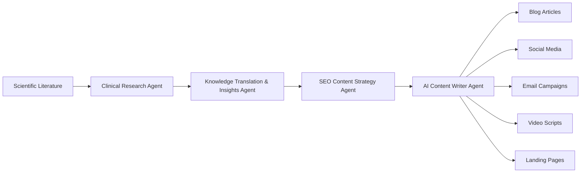

# AI Scientific Content Generation System

## Overview

The AI Scientific Content Generation System is a modular multi-agent architecture designed to transform scientific and clinical evidence into trustworthy, evidence-based healthcare content.

Instead of relying on a single AI model, the system orchestrates specialized AI agents that collaborate through a structured workflow. Each agent performs a dedicated task, ensuring scientific accuracy, knowledge translation, SEO optimization, and high-quality content creation.

The result is a scalable workflow capable of producing educational healthcare content that is evidence-based, easy to understand, and optimized for digital marketing across multiple platforms.

---

## Problem Statement

Healthcare content often faces two major challenges:

- Scientific information is difficult for the general public to understand.
- Marketing content frequently sacrifices scientific accuracy for engagement.

This project addresses both challenges by combining evidence-based research with AI-powered knowledge translation, SEO strategy, and specialized content generation.

---

## System Architecture

The system is composed of four specialized AI agents working sequentially.

Scientific Literature

↓

Clinical Research Agent

↓

Knowledge Translation & Insights Agent

↓

SEO Content Strategy Agent

↓

AI Content Writer Agent

↓

Blogs • Social Media • Email • Video Scripts • Landing Pages

## System Workflow

## AI Agents

### Clinical Research Agent

**Purpose**

Analyzes scientific literature to identify high-quality evidence and extract clinically relevant information.

**Responsibilities**

- Evidence synthesis
- Scientific literature analysis
- Mechanism identification
- Evidence quality assessment

---

### Knowledge Translation & Insights Agent

**Purpose**

Transforms complex scientific information into educational content that is understandable for non-specialists while preserving scientific accuracy.

**Responsibilities**

- Knowledge simplification
- Analogy generation
- Insight extraction
- Educational storytelling

---

### SEO Content Strategy Agent

**Purpose**

Builds a complete SEO-driven content architecture aligned with user search intent and digital marketing objectives.

**Responsibilities**

- Keyword clustering
- Content tree generation
- Search intent mapping
- Multi-platform planning

---

### AI Content Writer Agent

**Purpose**

Generates platform-specific educational content following editorial guidelines and SEO recommendations.

**Responsibilities**

- Blog writing
- Social media posts
- Video scripts
- Email campaigns
- Landing pages
