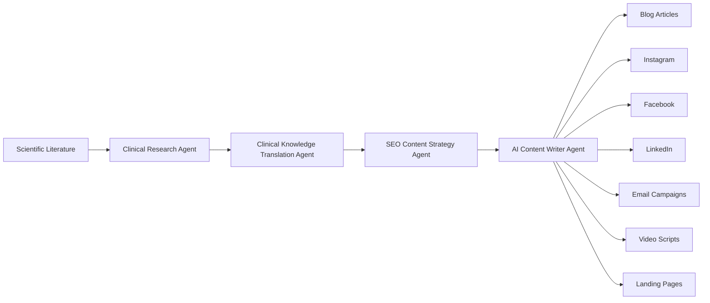

# System Architecture

The AI Scientific Content Generation System is composed of four specialized AI agents. Each agent performs a single responsibility and passes structured outputs to the next stage of the workflow.

---

## Design Principles

The architecture follows a modular pipeline where every AI agent has a clearly defined responsibility.

### Benefits

- Separation of responsibilities
- Modular architecture
- Reusable AI agents
- Consistent outputs
- Easier maintenance
- Higher content quality
- Reduced hallucinations through structured knowledge flow
